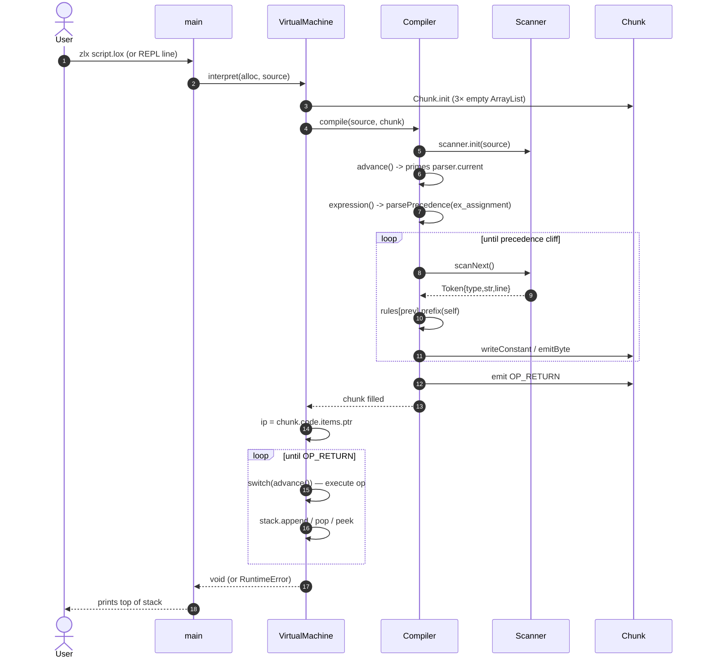

# zlx — Architecture & Optimization Research

> Snapshot of the codebase as of commit `eeb3992` (logical-not operator landed).
> The interpreter currently supports: numeric/bool/nil literals, unary `-` and `!`,
> binary arithmetic (`+ - * /`), grouping, and `return`. The compiler is a Pratt
> expression parser; the VM is a stack machine driven by a `switch` dispatch.

---

## 1. High-level component map

```mermaid
flowchart LR
    subgraph Entry [main.zig]
        Main([main])
        Repl([repl loop])
        RunFile([runFile])
    end

    subgraph VM [vm.zig — VirtualMachine]
        Interp([interpret])
        Run([run / dispatch])
        Stack[(ArrayList: Value stack)]
        IP{{ip: [*]u8}}
    end

    subgraph C [compiler.zig — Compiler]
        Compile([compile])
        Pratt([parsePrecedence])
        Rules[(static rules[]: ParseRule)]
        Emit([emitByte / writeConstant])
    end

    subgraph S [scanner.zig — Scanner]
        ScanNext([scanNext])
        Kw([inferIdentifierToken])
    end

    subgraph Ch [chunk.zig — Chunk]
        Code[(code: ArrayList u8)]
        Lines[(lines: ArrayList usize)]
        Vals[(values: ArrayList Value)]
    end

    subgraph V [value.zig]
        Val[/Value = union enum/]
    end

    subgraph D [debug.zig]
        Dis([disassembleChunk])
    end

    Main --> Repl & RunFile
    Repl --> Interp
    RunFile --> Interp
    Interp --> Compile
    Compile --> Pratt --> Rules
    Pratt --> ScanNext
    ScanNext --> Kw
    Pratt --> Emit --> Code & Lines & Vals
    Interp --> Run
    Run --> IP --> Code
    Run --> Stack
    Run -.debug.-> Dis
    Stack --> Val
    Vals --> Val
```

Key facts about the current shape:

- One `Compiler` and one `VirtualMachine` are reused across REPL turns; each
  `interpret` call creates a fresh `Chunk` that is `deinit`-ed at the end of the
  call (`vm.zig:25-27`).
- Bytecode, source-line table, and constant pool live as three parallel
  `ArrayList`s on `Chunk` (`chunk.zig:13-15`).
- `Value` is a Zig tagged union of `f64 | bool | u1(nil)` — 16 bytes today
  because of the tag (`value.zig:3-10`).
- Dispatch is a single `switch` over `OpCode` (`vm.zig:57-116`).

---

## 2. Script processing pipeline



Stage costs (current implementation):

| Stage          | Allocator hits per token / op                    | Notes                                                 |
| -------------- | ------------------------------------------------ | ----------------------------------------------------- |
| Scan           | 0 — slices into source buffer                    | Keyword check is a hand-rolled DFA in `inferIdentifierToken` |
| Parse + emit   | up to 3 `append`s per byte emitted (code + line) | Constants always append, no dedup                     |
| Dispatch       | 0 alloc steady-state; `stack.append` may grow    | Bounds-checked array index per op                     |
| Per chunk teardown | 3 `ArrayList.deinit`                          | Whole chunk is thrown away each REPL turn / each run  |

---

## 3. Optimization opportunities

Roughly ordered: cheap wins first, then larger structural changes, then changes
that should wait for upcoming features (functions, classes, GC).

Legend: **Effort** = S / M / L. **Impact** = on a Lox-style numeric microbenchmark
(fib, mandelbrot) compared to current code.

### 3.1 VM dispatch — switch → direct/indirect threaded

**Where:** `vm.zig:40-118` `run()`.

**Today:** every iteration goes `while(true) -> read byte -> switch -> case body
-> jump back to loop header`. The CPU branch predictor sees a single shared
indirect branch per opcode, which is the classic worst case.

**Options:**

- **Computed-goto / direct threading**: each handler ends with the *next*
  dispatch inline (`@call(.always_tail, handlers[ip[0]], .{...})`). Zig 0.14+
  supports always-tail calls so you get a true threaded interpreter without C's
  `&&label` extension. *Impact: 15–30% on tight loops.*
  - Ref: Ertl & Gregg, *The Structure and Performance of Efficient Interpreters*,
    JILC 2003 — quantifies threading wins (~2× on some workloads).
  - Ref: Bell, *Threaded Code* (1973) — original idea.

- **Token threading** (store handler pointers instead of opcodes): even faster
  decode but bloats bytecode 4–8×. Probably not worth it for zlx.

- **Superinstructions**: fuse common pairs like `OP_CONSTANT + OP_ADD` →
  `OP_ADD_CONST`. Cheap once you have a profiler-driven pair list.
  - Ref: Piumarta & Riccardi, *Optimizing direct threaded code by selective
    inlining* (1998).

**Effort:** M. **Impact:** large for arithmetic-heavy code.

### 3.2 Stack — cached top in a register

**Where:** `vm.zig:21` `stack: std.ArrayList(Value)` plus every `stack.append`
and `stack.pop`.

**Today:** every push/pop goes through `ArrayList` which does a length update,
bounds-checked indexing, and a possible `ensureTotalCapacity`. For a stack with
a known max (`main.zig:14` already reserves a `VM_MAX_STACK_SIZE` constant),
this is overkill.

**Options:**

- Replace `ArrayList` with a fixed `[STACK_MAX]Value` plus a raw `stack_top:
  [*]Value` pointer (mirror of `ip`). Push = `stack_top[0] = v; stack_top += 1`,
  pop = `stack_top -= 1; return stack_top[0]`. Removes the allocator parameter
  threading through `run`. This is exactly what Clox does and what the
  `stack_buffer` constant in `main.zig` was clearly anticipating.
- Bonus: keep the top-of-stack value in a *local* variable across a basic block
  so the optimizer can pin it to a register ("top-of-stack caching", TOSCA).
  - Ref: Ertl, *Stack Caching for Interpreters* (PLDI 1995).

**Effort:** S for the fixed array; M for TOSCA. **Impact:** 10–25%.

### 3.3 Constant pool deduplication

**Where:** `chunk.zig:34-53` `writeConstant`.

**Today:** every `number()` call appends a fresh entry to `chunk.values`. The
expression `1 + 1 + 1` allocates three identical `Value`s and emits three
`OP_CONSTANT` instructions referencing distinct indices. Each one also pushes
the line-number array.

**Options:**

- Linear scan for an existing equal `Value` before appending. Cheap for small
  chunks (≤ 256 constants stays in the L1 cache). O(n) per emit → O(n²) per
  chunk worst-case; fine for hand-written code, bad for codegen output.
- Switch to a `HashMap(Value, u16)` once constants exceed ~64. Use FNV-1a or
  Wyhash (`std.hash.Wyhash`) over the value bytes.
  - Ref: Knuth, *TAOCP* Vol 3 §6.4 on open addressing.

**Effort:** S. **Impact:** small on speed, real on memory and on debug output
readability. Also a prerequisite for cheap *constant folding* in the compiler
(see 3.6).

### 3.4 Line-number table — run-length encoding

**Where:** `chunk.zig:14` `lines: ArrayList(usize)`; written on every
`chunk.write` (`chunk.zig:30-32`).

**Today:** one `usize` (8 bytes on 64-bit) per bytecode byte. For a 10k-byte
chunk that is 80 KB of line numbers, almost entirely duplicates.

**Options:**

- Crafting Interpreters challenge 14.1 — store runs `(line, count)` and binary
  search by accumulated count on error. Drops typical overhead 10–50×.
  - Ref: Nystrom, *Crafting Interpreters*, Ch. 14 challenge.
- Delta encoding (varint) is more compact still but needs a sequential scan to
  resolve; fine because lookup only happens on errors.

**Effort:** S. **Impact:** memory only, but removes a hot-loop allocation on
every `emitByte`.

### 3.5 Value representation — NaN-boxing

**Where:** `value.zig:3-10` (`Value` union), all `stack.append` / `pop` /
indexing in `vm.zig`.

**Today:** Zig tagged union for `f64 | bool | u1` is 16 bytes (8 payload + tag
+ padding). Every push moves 16 bytes; the stack uses 2× the cache footprint it
needs.

**Options:**

- **NaN-boxing**: encode every value as a single `u64`. IEEE-754 doubles have
  ~2^51 unused NaN bit patterns; stuff `nil`, `true`, `false`, and (later)
  pointers to heap objects in there. Halves stack memory and lets the VM use
  raw `u64` registers in many ops.
  - Ref: Gudeman, *Representing Type Information in Dynamically Typed
    Languages* (1993) — original write-up.
  - Ref: Crafting Interpreters Ch. 30, *Optimization*.
- **Tagged pointers** (low-bit tag) are an alternative if you'd rather not
  reserve NaN bits — common in V8/JSC. Slightly worse for numbers, slightly
  better for pointers.

**Effort:** M. Touches `Value`, `vm.zig` ops, `debug.zig` printing. **Impact:**
5–15% from cache effects, plus headroom for cheaper heap-object handling later.

> ⚠ Caveat: NaN-boxing makes debug printing and ASAN-style tooling harder.
> Gate it behind a `comptime` flag so `builtin.mode == .Debug` keeps using the
> tagged union.

### 3.6 Compile-time constant folding & peephole

**Where:** `compiler.zig:127-140` `binary`, `compiler.zig:142-153` `unary`.

**Today:** `-3` compiles to `OP_CONSTANT 3, OP_NEGATE` (two ops, one slot).
`2 + 3` is three ops + two slots.

**Options:**

- After emitting an operand, check if the previous two emissions were both
  `OP_CONSTANT` literals; if so, evaluate the op at compile time and rewrite
  the chunk tail to a single constant. Pure peephole, no IR needed.
- Generalize to a tiny per-chunk peephole pass before `endCompilation`:
  fold `OP_TRUE/OP_NOT → OP_FALSE`, fold `OP_CONSTANT 0 + OP_ADD → nop`, etc.
  - Ref: McKeeman, *Peephole Optimization* (CACM 1965) — the original.
  - Ref: Aho, Sethi, Ullman, *Compilers: Principles, Techniques, and Tools*,
    §9.9.

**Effort:** S–M. **Impact:** big on expression-heavy code; effectively free
once you have constant dedup (3.3).

### 3.7 Scanner — keyword recognition

**Where:** `scanner.zig:216-253` `inferIdentifierToken` + `checkKeyword`.

**Today:** a hand-coded trie keyed on the first one or two characters, then
`std.mem.eql` on the tail. Works but the comparisons are byte-by-byte and the
trie branches mispredict on identifier-heavy code.

**Options:**

- **Perfect hash** at `comptime` (Zig is great for this): generate a small
  hash table over the 16 keywords; one hash + one `memcmp` per identifier.
  - Ref: Cichelli, *Minimal Perfect Hash Functions Made Simple* (CACM 1980).
  - Ref: `gperf` — the canonical generator; the algorithm is small enough to
    port to a Zig `comptime` block.
- **Aho–Corasick** if/when you need multi-keyword search in strings; overkill
  for an identifier lexer.
- Micro: bound `checkKeyword` reads with `self.eof` instead of trusting the
  slice — current code reads `self.start[pos + keyword_part.len]` which is one
  byte past the end if the identifier ends exactly at EOF. (This is a
  correctness issue, not just perf.)

**Effort:** S for the perfect hash; the EOF bound is a one-liner. **Impact:**
small per-token; matters in heavy macro-expanded code.

### 3.8 Bytecode layout — operand alignment

**Where:** `chunk.zig:42-49` long-constant emission; `vm.zig:62-70` decode.

**Today:** `OP_CONSTANT_LONG` writes `low, high` as two separate bytes. The VM
reads them with two `advance()` calls and shifts. That's fine, but it leaves
performance on the table once you add jump offsets, `OP_GET_LOCAL`, etc.

**Options:**

- Reserve a 2- or 4-byte-aligned operand slot and `@bitCast` the read instead
  of byte-shuffling. On x86_64 this is one MOV.
- Or commit to a fixed 4-byte-per-instruction encoding (à la JVM's `wide` ops)
  if you decide that decode simplicity beats density. Probably *not* worth it
  for zlx — Clox's variable encoding is fine.

**Effort:** S. **Impact:** tiny on its own but tidies the decode hot path.

### 3.9 Debug overhead

**Where:** `vm.zig:42-53` stack dump and `disassembleInstruction` call inside
the hot loop, gated by `builtin.mode == .Debug`.

**Today:** correctly gated to debug builds, so release is unaffected. Worth
documenting because the `std.debug.print("        ", .{})` loop *significantly*
slows debug benchmarking — surprising people often blame the VM.

**Options:**

- Add a `comptime` `TRACE_EXECUTION` flag separate from `builtin.mode` so you
  can toggle the trace without dropping all the assertions.

**Effort:** S. **Impact:** none in release, large for debug-mode profiling.

### 3.10 Future-facing (gate on upcoming features)

These do **not** make sense to land today but should shape current decisions.

- **Inline caching for property access** (when classes land). Reserve a slot
  next to `OP_GET_PROPERTY` for the last-seen class pointer + offset. Lookup
  becomes a pointer compare on the hot path.
  - Ref: Deutsch & Schiffman, *Efficient Implementation of the Smalltalk-80
    System* (POPL 1984) — invention of inline caches.
  - Ref: Hölzle, Chambers, Ungar, *Optimizing Dynamically-Typed
    Object-Oriented Languages With Polymorphic Inline Caches* (ECOOP 1991).

- **Hidden classes / shape trees** for objects. V8/Dart use this. Pairs with
  inline caching; without it, ICs degrade quickly.

- **Open-addressing string table with FNV-1a** for string interning (when
  strings land). Compare by pointer identity afterwards.
  - Ref: Crafting Interpreters Ch. 20.
  - Ref: Fowler-Noll-Vo, *FNV hash*.

- **Tri-color mark-sweep with a write barrier**, ideally generational once you
  have closures (most allocations die young).
  - Ref: Dijkstra et al., *On-the-Fly Garbage Collection: An Exercise in
    Cooperation* (CACM 1978).
  - Ref: Jones, Hosking, Moss, *The Garbage Collection Handbook* (2011).

- **Cranelift / LLVM-style register-based bytecode**. Lua 5+ uses a register
  VM; ops touch fewer memory locations than stack VMs. Big change to the
  compiler; only worth it if you decide stack-VM dispatch wins are tapped out.
  - Ref: Ierusalimschy, de Figueiredo, Celes, *The Implementation of Lua 5.0*
    (2005).

- **Tail-call elimination of recursive Lox calls** once functions land. Needs
  `OP_TAIL_CALL`; saves the call frame allocator hit on `fib`-style code.
  - Ref: Clinger, *Proper Tail Recursion and Space Efficiency* (PLDI 1998).

---

## 4. Quick punch-list

If you want to do something small *today* without disrupting the upcoming
function/class work:

1. Constant dedup (3.3) — 20 lines in `chunk.zig`, immediately shrinks debug
   output and unblocks folding.
2. Line RLE (3.4) — 30 lines, drops chunk memory.
3. EOF bound in `checkKeyword` (3.7) — one-line correctness fix; do this even
   if you don't tackle the perfect hash.
4. Comptime `TRACE_EXECUTION` flag (3.9) — makes everything else easier to
   benchmark.

The structural wins — threaded dispatch (3.1), fixed stack + TOSCA (3.2),
NaN-boxing (3.5) — are best landed *together* once functions exist, because
they all touch the same VM hot path you'll be rewriting anyway.

---

## 5. References (consolidated)

- Bell, J. — *Threaded Code*, CACM 1973.
- Cichelli, R. — *Minimal Perfect Hash Functions Made Simple*, CACM 1980.
- Clinger, W. — *Proper Tail Recursion and Space Efficiency*, PLDI 1998.
- Deutsch, P., Schiffman, A. — *Efficient Implementation of Smalltalk-80*, POPL 1984.
- Dijkstra, E. et al. — *On-the-Fly Garbage Collection*, CACM 1978.
- Ertl, M. A. — *Stack Caching for Interpreters*, PLDI 1995.
- Ertl, M. A., Gregg, D. — *The Structure and Performance of Efficient Interpreters*, JILC 2003.
- Gudeman, D. — *Representing Type Information in Dynamically Typed Languages*, 1993.
- Hölzle, U., Chambers, C., Ungar, D. — *Polymorphic Inline Caches*, ECOOP 1991.
- Ierusalimschy, R. et al. — *The Implementation of Lua 5.0*, 2005.
- Jones, R., Hosking, A., Moss, E. — *The Garbage Collection Handbook*, 2011.
- McKeeman, W. — *Peephole Optimization*, CACM 1965.
- Nystrom, R. — *Crafting Interpreters* (esp. Ch. 14, 20, 24, 30).
- Piumarta, I., Riccardi, F. — *Optimizing direct threaded code by selective inlining*, PLDI 1998.
